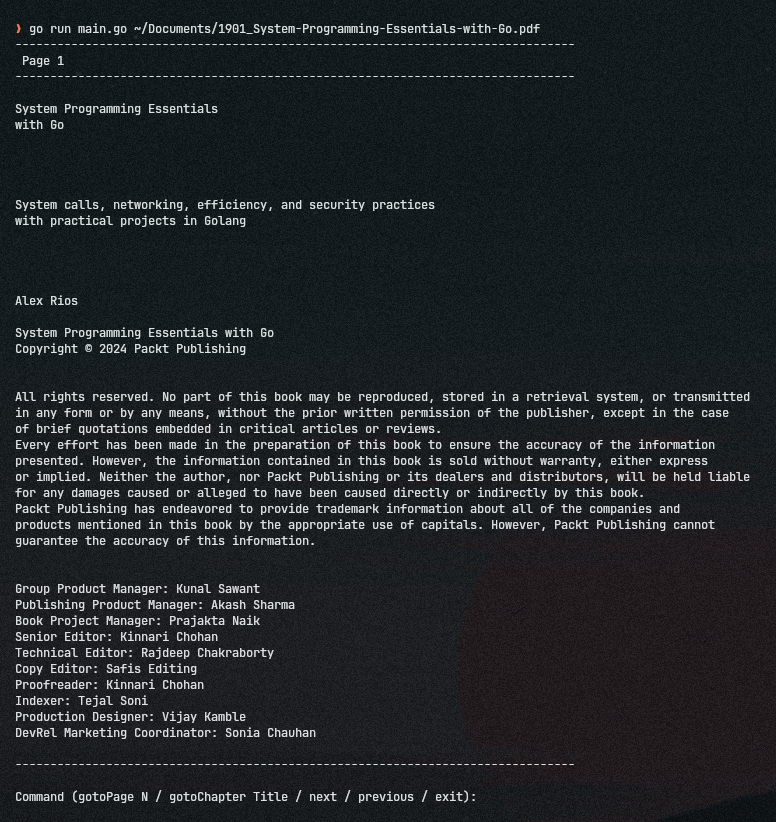

````markdown
# tpdf - Terminal PDF Viewer

`tpdf` is a terminal-based PDF viewer written in Go. It converts PDF files to plain text, formats them with ASCII layout, and allows navigation through pages and chapters using terminal commands.

## Features

- Converts PDF to text using `pdftotext` (Poppler)
- Displays formatted content with ASCII styling
- Supports:
  - `gotoPage N` – Jump to a specific page
  - `gotoChapter Title` – Jump to a specific chapter
  - `next` – Move to the next page
  - `previous` – Move to the previous page
  - `exit` – Exit the viewer

## Requirements

- Go 1.18 or higher
- `pdftotext` from the `poppler-utils` package

### Install pdftotext

On Debian/Ubuntu:

```bash
sudo apt install poppler-utils
````

On Arch Linux:

```bash
sudo pacman -S poppler
```

## Installation

Clone the repository:

```bash
git clone https://github.com/prem0x01/tpdf.git
cd tpdf
```

Build the project:

```bash
go build -o tpdf main.go
```

## Usage

```bash
./tpdf your_file.pdf
```

Once inside the viewer, use the following commands:

* `gotoPage 3` – Go to page 3
* `gotoChapter Introduction` – Jump to the chapter named "Introduction"
* `next` – Next page
* `previous` – Previous page
* `exit` – Quit the viewer


## Demo

### Help Screen


### Example PDF Page View


